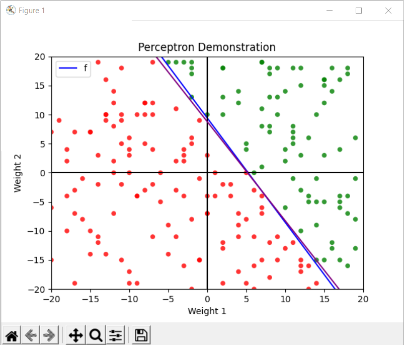

# Perceptron

This is my implementation of Perceptron for exercise 1.4 of Learning from Data a Short Course

It is a Python implementation of the Perceptron algorithm.

## How Perceptron Program Works (generally)

1. Create data set (it must be labeled)
2. Calculate some function (f) which splits the data into two sections
3. Generate some function that represents perceptron running which classifies the data
4. Run the perceptron function
5. Run the update function $w(t+1)=w(t)+y(t)x(t)$ on some given incorrect point. If there are none we're done!
   1. Increment the repitition counter
6. Rerun 4 and 5 until complete

## How to Run

    python perceptron.py --num-points 20

      --num-points NUM_POINTS, -n NUM_POINTS
                        The number of points of data you would like to generate.
      --start-weights START_WEIGHTS, -s START_WEIGHTS
                            A tuple containing the starting values for x and y you would like to use. Defaults to (1, 1)
      --bias BIAS, -b BIAS  The bias to use in the equation y=b+w1+w2. Keep in mind w could be negative. The bias must be
                            between -10 and 10
      --pause-length PAUSE_LENGTH, -p PAUSE_LENGTH
                            How long to pause and show the graph between iterations of the perceptron.
      --load-previous-data LOAD_PREVIOUS_DATA
                            Load a file with the contents of a previous f_data. Mainly used for debugging.
      --draw-iterations     If set to true it will draw every iteration of the algorithm. You can control how fast the
                            draw occurs with pause-length.

## What it Looks Like

## Known Problems

- The purple line $h$ is not labeled